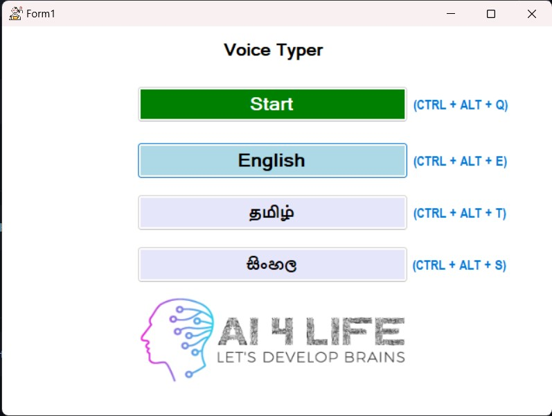

# Voice Typer


## Introduction

This is a simple program that can be used to type with voice inputs. It supports 3 languages, those are Tamil, Sinhala, and English. This system can be used to type anywhere within a computer program. It converts the voice into the text and writes that text in the place where the cursor is pointed.

Voice Typer will be a good tool for teachers who wants to type exam papers in Tamil, Sinhala and, English languages with voice inputs.

## Technical Information

Voice Typer is written in Python and, C#. The main voice conversion process is handled by a python script that uses Google speech recognition technology.

C# is to used for user interface desgin and handles the logic behind swtiching between languages.

## Technology & Frameworks
- Python
- C#
- Argparse
- Pynput
- Psutil
- Keyboard
- Playsound
- Google SpeechRecognition


### Technical Requirements

- Python 3
- .NET Framework 4.5.2

## Configuration & Setup

- Installing argparse

  ```
    pip install argparse
  ```

- Installing psutil

  ```
    pip install psutil
  ```

- Installing keyboard

  ```
    pip install keyboard
  ```

- Installing playsound

  ```
    pip install playsound
  ```

- Installing SpeechRecognition

  ```
    pip install SpeechRecognition
  ```

- Installing Pynput

  ```
    pip install pynput
  ```

## Demo



## Execution and Running

### Run Method 1


```
  Execute the (voice_typer.exe) that is found on "Voice_Typer\bin\Debug"
```

### Run Method 2

```
  Open the project using Visual Studio and click debuging to run the project.
```


# CONTACT

### Website: 

[](http://www.gunarakulan.info)

### Social Media:

[](https://www.linkedin.com/in/gunarakulangunaretnam)
[](https://www.facebook.com/gunarakulangunaretnam)
[](https://wa.me/94740001141?text=WhatsApp%3A%20%2B9740001141)
[](https://www.instagram.com/gunarakulangunaretnam)
[](https://x.com/gunarakulangr)
[](https://www.kaggle.com/gunarakulangr)
[](https://www.tiktok.com/@gunarakulangunaretnam)
[](https://www.youtube.com/channel/UCjMOdgHFAjAdBKiqV8y2Tww)
